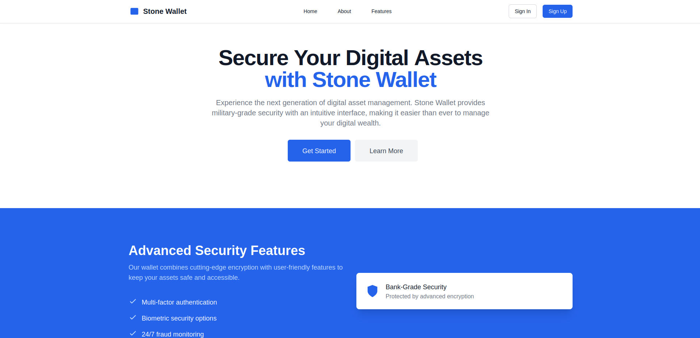
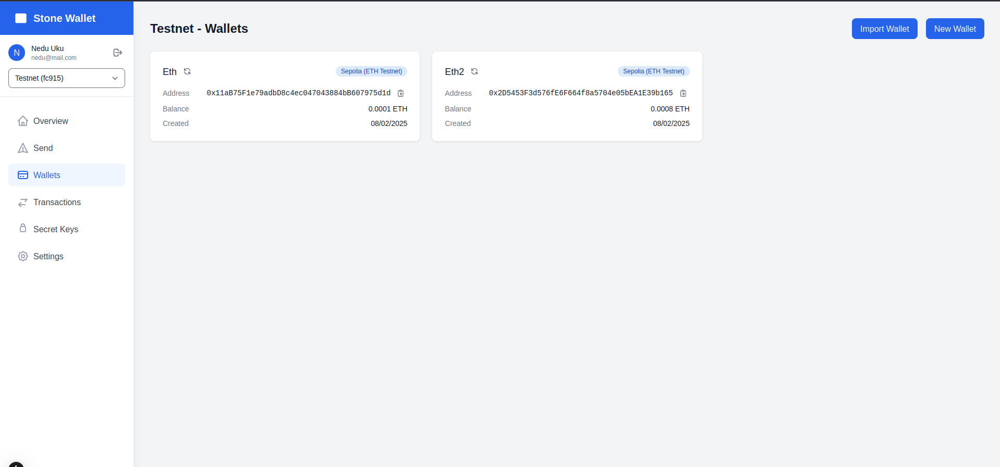

Landing Page


Dashboard view


## Getting Started

First, run the development server: Note that this project uses yarn but you can change it if you want to use npm or pnpm

```bash
npm run dev
# or
yarn dev
# or
pnpm dev
# or
bun dev
```

Open [http://localhost:3000](http://localhost:3000) with your browser to see the result.

## Create account on Alchemy

Create an account on Alchemy to get API key [https://www.alchemy.com](https://www.alchemy.com/)

Add the API key in the .env file at the root of the project:

```text
ALCHEMY_API_KEY=your_api_key_here
```

## Database Setup

The application uses a local JSON database stored in `src/db/database.txt`. This file is git-ignored to protect sensitive data.

### Initial Database Setup

1. Create a new file at `src/db/database.txt`
2. Initialize it with the following structure:

```json
{
	"users": [],
	"wallets": [],
	"transactions": []
}
```

### Database Structure

- **Users**: Store user authentication and profile data
- **Accounts**: Group wallets under user accounts
- **Wallets**: Store wallet information including addresses and balances
- **Transactions**: Record all wallet transactions with their details

### Security Notes

- The database.txt file contains sensitive information (private keys, user data)
- Never commit this file to version control
- Keep regular backups of this file
- Consider encrypting sensitive fields in production

## IMPORTANT

When creating wallets select Sepolia [testnet] and get test ETH from a faucet for transactions to work.

## Deploy on Vercel

The easiest way to deploy your Next.js app is to use the [Vercel Platform](https://vercel.com/new) from the creators of Next.js.

Check out our [Next.js deployment documentation](https://nextjs.org/docs/app/building-your-application/deploying) for more details.
